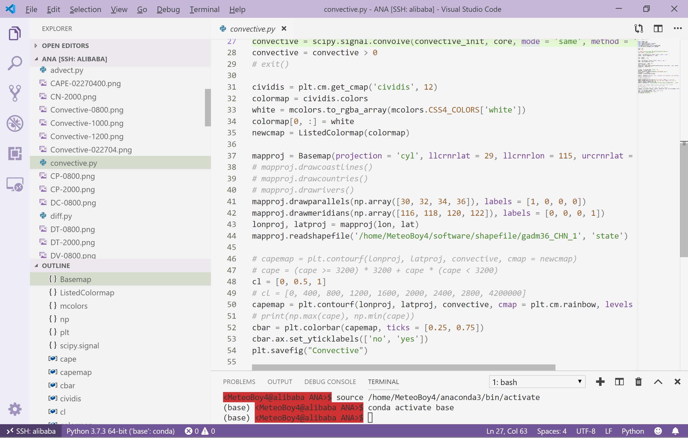

让VS Code带你飞上云端

<!--more-->

## 动机

作为编程必须的生产工具，文字编辑器在这个时代层出不穷，从服务器端原生的vim，到特定于某些环境和语言的Visual Studio IDE和JetBrains系列这些集成开发系统，再到通用编辑器Sublime Text、Atom以及VS Code。就本人来说，我越来越喜欢一些轻量级的、综合各个语言的编辑器，加之现在大厂开始努力向开源进军，[VS Code][]以其轻量级、Microsoft原生支持和开源等属性，开始赢得越来越多人的青睐。

另一方面，云服务器蓬勃发展，存储和计算的价格开始平民化，将计算和服务部署在云端或远程服务器上进行远程开发和运行，而非在本地，不失为好的选择。

那么是否可以使用VS Code进行远程开发呢？答案是肯定的，在2019年4月发布的[1.34][]版本上，Microsoft正式将远程开发模块加入VS Code。

## 三种类型

VS Code为大家准备了三种远程开发的功能类型，对应其[Remote Development extension pack][]的三个子扩展包，分别为使用ssh远程打开服务器进行开发、直接使用Docker容器作为开发环境、使用WSL（Windows下Linux子系统）进行类Linux环境开发。这里我们来讲讲第一种远程开发，也是最为常见的一种。

## 设置步骤

机器准备：既然为远程开发，就会涉及本地和远程至少两台机器。本地上当然需要装上VS Code，这里本地机器我使用的是Windows 10（因为现在用了surface啊喂，的确Windows还是方便一些，开发的事交给云服务器就行，工作和生活分离嘛~所以要远程开发呀！），同时由于需要使用ssh进行两台机器之间的通讯，本地机器上需要安装SSH客户端：Windows 10上可以直接安装Windows OpenSSH客户端（见后文），更早一些的Windows则需要Git for Windows来安装，Linux们和基于Linux的macOS则直接使用包管理安装openssh-client(s)即可（一般都会自带的）。远程服务器自然是Linux系统（阿里云的CentOS、其他地方自己装的Linux服务器等），需要开启ssh服务，直接用包管理安装openssh-server，然后开启ssh服务即可（一般也是自带的）。具体步骤如下：

1. 本地安装SSH客户端：Windows 10直接提供了图形化的安装界面，打开控制面板（Windows设置），点击“应用”选项卡，在“应用和功能”分类下找到“管理可选功能”，看看里面有没有OpenSSH客户端已经安装好了，如果没有，点击“添加功能”，找到OpenSSH客户端，点击安装即可。

2. 安装VS Code插件[Remote Development extension pack][]：和一般的插件安装一样，搜索，安装（如果暂时不用其他两种远程功能，也可只安装[Remote - SSH][]）

3. 在本地和远程机之间建立基于密匙的身份认证：这里的原理与所述基本相同。在Windows 10底下生成密匙对也很简单，打开PowerShell（注意不是PowerShell ISE，是单独的命令行），输入`ssh-keygen`，一路回车后生成密匙对，默认路径在C:\Users\username\\.ssh\。

   为了更好的保护生成的私匙，还可以启用ssh-agent服务来将私匙用ssh-add加入到agent中，这样agent就可以自动获取私匙，也可以让VS Code在使用需要passphrase的密匙对时不需要再输一次密码就可以自动登录，具体做法参见[Setting up the SSH Agent][]和[User key generation][]。

   然后把公匙传到服务器端，直接copy到服务器的~/.ssh/authorized_keys最后即可。

4. 在Command Palette（F1）中打开**Remote-SSH: Connect to Host...** 然后输入远程服务器的用户名和主机名（IP），按回车后VS Code会帮你自动连接服务器并设置远程开发环境，不用再人为做什么操作，连接和设置成功后会弹出一个空的新VS Code窗口，这便是连上服务器的VS Code，下面就可以像在本地一样打开文件、文件夹或者工作空间了。

## 效果与调试

1. 注意在这个远程VS Code上，你的插件和本地的是独立不相关的（除了一些涉及用户界面的插件会在本地外），你可以安装在远程时需要的插件，比如[Python][]，其会自动寻找服务器上的Python解释器来作为插件的Python环境。要注意的是有时你想用ctrl+左键来跳转到变量定义的功能在服务器端没法实现，这是因为ctrl键被多光标快捷键占用了，在Command Palette打开settings.json（这里是指本地的，当然在连接上服务器后打开**Preferences: Open Remote Settings**可以设置只针对该服务器的属性），设置以下字段即可

	"editor.multiCursorModifier": "alt",

2. 接下来还可以在Command Palette（F1）打开**Remote-SSH: Open Configuration File...**来编辑本地的ssh config文件，具体做法参见。这样它们会自动出现在连接host的下拉框中。
3. 打开远程的VS Code后再**Terminal > New Terminal**便会打开远程服务器上的终端，可以直接运行命令啦~打开左侧的Explorer也可以像在本地一样查看文件、脚本、图像，配合插件还可以显示一些变量的概况等。
4. 更重要的是，使用[Remote - SSH][]时，debug的功能和在本地几乎一模一样完全可用，不用在远程机器上进行任何安装！只需配置好launch.json文件，设置好你需要的breakpoint，logpoint，进行debug时便可在debug栏中查看、监测变量数值，甚至可以在debug终端上直接使用REPL功能进行表达式的数值输出。具体的debug功能参见[VS Code Debugging][]

Enjoy it！

参考网页：[VS Code Remote Development][]、[Remote Development using SSH][]、[SSH Tips and Tricks][]、[Installation of OpenSSH][]、[OpenSSH Key Management][]、[Ctrl + Click - Github issue][]

[VS Code]: https://code.visualstudio.com/
[1.34]: https://code.visualstudio.com/updates/v1_34
[Remote Development extension pack]:https://aka.ms/vscode-remote/download/extension
[Remote - SSH]: https://marketplace.visualstudio.com/items?itemName=ms-vscode-remote.remote-ssh
[Setting up the SSH Agent]: https://code.visualstudio.com/docs/remote/troubleshooting#_setting-up-the-ssh-agent
[User key generation]: https://docs.microsoft.com/en-us/windows-server/administration/openssh/openssh_keymanagement#user-key-generation
[Python]: https://marketplace.visualstudio.com/items?itemName=ms-python.python
[VS Code Remote Development]: https://code.visualstudio.com/docs/remote/remote-overview
[Remote Development using SSH]: https://code.visualstudio.com/docs/remote/ssh
[SSH Tips and Tricks]: https://code.visualstudio.com/docs/remote/troubleshooting#_ssh-tips
[Installation of OpenSSH]: https://docs.microsoft.com/en-us/windows-server/administration/openssh/openssh_install_firstuse
[OpenSSH Key Management]: https://docs.microsoft.com/en-us/windows-server/administration/openssh/openssh_keymanagement
[Ctrl + Click - Github issue]: https://github.com/Microsoft/vscode/issues/32143
[VS Code Debugging]:https://code.visualstudio.com/docs/editor/debugging